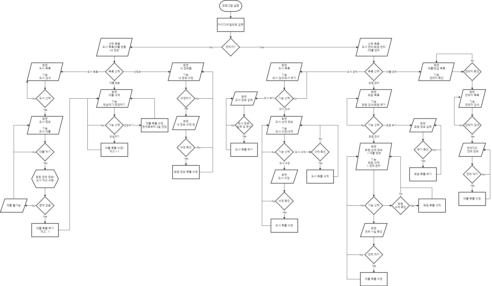

설명
================================

파일 구조
--------------------------------

```txt
main.py: 메인 함수 코드. 프로그램 실행 시 이 파일 실행


modules/: ui와 연결되는 모듈이나 기타 파이썬(.py) 모듈들 모음 폴더
│
├─── functions.py: 각종 유용한 사용자 함수 모음 모듈
│
├─── MainWindow.py: main_window.ui 파일과 연결하여 첫 화면 동작 구현
│
├──- MainWindowGeneral.py: 일반 회원 로그인 시 초기 화면 동작 구현
│
└─── MainWindowManager.py: 관리자 로그인 시 초기 화면 동작 구현


user_interfaces/: .ui 파일들 모음 폴더
│
├─── main_window.ui: 메인 윈도우의 ui를 구성하는 파일
│
├─── main_window_general.ui: 일반 회원 로그인 초기 화면 ui
│
└─── main_window_manager.ui: 관리자 로그인 초기 화면 ui


images/: 이미지, 아이콘 등 모음 폴더
│
└─── icon.ico 프로그램 아이콘


defines/: 상수 값 모음 .py 파일들 모음 폴더
│
├─── strings.py: 프로그램에서 사용되는 문자열들 지정
│
└─── paths.py: 각종 필요한 파일의 절대/상대 경로들 지정


temp/: 기타 파일들
│
├─── dbProjectQuery.sql: 데이터베이스 및 테이블 생성 쿼리
│
├─── .sql 확장자 파일들: 기타 쿼리들
│
└─── .drawio, .png 확장자 파일들: uml 관련 파일


.gitignore: 깃허브에 업로드 되지 않는 파일들 지정


README.md: 도움말 파일
```


구현 기능
--------------------------------

* ### 테이블/속성
| 테이블   | 속성                                                         |
|----------|--------------------------------------------------------------|
| 도서     | 도서번호P/도서명/저자/출판사/출판일자/카테고리/재고권수      |
| 회원     | 회원아이디P/비밀번호/회원명/전화번호/주소/이메일/회원등급    |
| 대출내역 | 대출번호P/회원아이디R/도서번호R/대출일/반납(예정)일/반납상태 |


### 도서 관리

**일반 회원**
* 도서 목록 확인 및 검색
* 도서 대출

**관리자**
* 도서 추가
* 도서 삭제
* 도서 정보 수정


### 회원 관리

**일반 회원**
* 내 정보 보기
* 내 정보 수정

**관리자**
* 회원 삭제
* 회원 정보 수정
* 특정 회원 연체 관리


### 도서 대출/반납

**일반 회원**
* 도서 대출 내역 확인
* 도서 반납
* 대출 연장

**관리자**
* 전체 대출/반납 현황
* 연체자 목록 확인 및 연체 관리

### ER 다이어그램


### 플로우 차트




프로그램 사용 전 세팅들
================================

MSSQL 초기 세팅
--------------------------------
* ### 반드시 해야 프로그램 정상 작동 함!


* #### SMMS 설정 https://freesugar.tistory.com/35

* DB명은 BookManagement, 테이블 명은 Member, Book, Loan으로 temp/dbProjectQuery.sql의 쿼리 실행 시 자동 적용

* 로그인 이름과 비밀번호는 pyuser, 1234로 할 것

* 사용자 매핑 시 BookManagement 지정

<br>

* 데이터베이스와 테이블 생성 쿼리는 temp/dbProjectQuery.sql에 있음

* 도서 추가 예시 2개, 회원 추가 예시 2개는 dbProject1.sql에 있음

* 대출 추가 예시는 dbProjectTest3.sql에 있음


작업 진행 내용, 이슈
================================

ui 파일 꾸며주세요
--------------------------------


실제 사용 쿼리
--------------------------------

### 메인 화면

**회원 가입**

```SQL
-- 입력한 아이디가 이미 존재하는 지 확인하는 쿼리 --
SELECT uid FROM Member WHERE uid = uid;

-- 새로운 회원 추가 --
INSERT INTO Member (uid, password, username, phone, address, email, grade) 
VALUES ('아이디', '비밀번호', '본명', '000-0000-0000(전화번호)', '주소', '-@-.-(이메일)', '회원 등급(일반회원/관리자)');
```

**로그인**

```SQL
-- 아이디 존재 여부 확인 및 튜플 출력 --
-- *비밀번호 대조는 출력된 튜플의 비밀번호와 폼에 입력한 값 비교 --
SELECT * FROM Member WHERE uid = '아이디'
```


### 일반 회원 - 도서 검색

**도서 검색**
```SQL
-- 도서 검색--
SELECT * 
FROM Book 
WHERE 도서컬럼명 LIKE '%입력값%'
[AND category = 입력값]
ORDER BY bookname ASC;

-- 도서 상세정보 --
SELECT *
FROM Book
WHERE bid = bid
```

**도서 대출**
```SQL
-- 회원의 도서 연체 유무 검색 --
SELECT lid
FROM Loan
WHERE uid = '회원id'
AND returndate < '반납일(date)'
AND returnstatus = '미반납'

-- 현재 도서의 재고가 있는지 확인하는 쿼리
SELECT quantity
FROM Book
WHERE bid = '도서번호(int)'

-- 도서 대출 쿼리 --
INSERT INTO Loan (uid, bid, loandate, returndate, returnstatus) 
VALUES ('회원id', '도서번호(int)', '대출일(date)', '반납예정일(date)', '미반납');

-- 도서 재고 -1 --
UPDATE Book
SET quantity = '기존재고수량-1(int)'
WHERE bid = '도서번호(int)';
```

### 일반 회원 - 대출 관리

**대출 내역 검색**
```SQL
-- 회원의 도서 대출 내역 검색 --
SELECT bookname, loandate, returndate, returnstatus, lid
FROM Loan, Book
WHERE Loan.bid = Book.bid
AND Loan.uid = '회원id'
ORDER BY loandate DESC, lid DESC

```

**도서 반납**
```SQL
-- 도서 반납 쿼리 --
UPDATE Loan
SET returnstatus = '반납됨'
WHERE lid = '대출번호(int)'

-- 도서 재고 +1을 위한 기존 도서 재고량 검색 --
SELECT Book.bid, quantity
FROM Book, Loan
WHERE Book.bid = Loan.bid
AND lid = '대출 번호(int)'

-- 도서 재고 +1 --
UPDATE Book
SET quantity = '기존재고수량+1(int)'
WHERE bid = '도서번호(int)'
```

**대출 기한 연장**
```SQL
UPDATE Loan
SET returndate = '새로운반납일자(date)'
WHERE lid = '대출번호(int)'
```

### 일반 회원 - 회원 정보

**회원 정보 수정(전화번호, 주소, 이메일)**
```SQL
UPDATE Member
SET phone = '새전화번호', address = '새주소', email = '새이메일'
WHERE uid = '회원id'
```

**회원 비밀번호 수정**
```SQL
UPDATE Member
SET password = '새비밀번호'
WHERE uid = '회원id'
```


### 관리자 - 도서 관리

**도서 검색** [일반 회원 - 도서 검색]과 동일

```SQL
-- 도서 검색--
SELECT * 
FROM Book 
WHERE 도서컬럼명 LIKE '%입력값%'
[AND category = 입력값]
ORDER BY bookname ASC;

-- 도서 상세정보 --
SELECT *
FROM Book
WHERE bid = bid
```

**도서 추가**

```SQL
-- 중복 도서 확인 --
SELECT * FROM Book WHERE bookname = %s

-- 도서 추가 쿼리 --
INSERT INTO Book (bookname, writer, publisher, pubdate, category, quantity) 
VALUES ('도서명', '저자', '출판사', 'yyyy-mm-dd(출판일)', '카테고리', '재고권수(int)');
```

**도서 수정**

```SQL
UPDATE Book
SET bookname = '도서명', writer = '저자', publisher = '출판사', pubdate = '출판일', category = '카테고리', quantity = '재고권수(int)'
WHERE bid = '도서번호(int)'
```

**도서 삭제**

```SQL
-- 해당 도서를 빌리고 있는 회원이 있는지 확인 *있으면 삭제 불가 --
SELECT *
FROM Loan
WHERE bid = '도서번호(int)'

-- 해당 도서를 빌리고 있는 사람이 없으면 먼저 대출 내역부터 삭제 --
-- 해당 도서에 관한 모든 Loan 튜플이 도출됨
SELECT lid
FROM Loan
WHERE bid = '도서번호(int)'
-- 위에서 도출된 모든 튜플에 대해서 삭제
DELETE FROM Loan
WHERE lid = '각 lid값(int)'

-- 도서 삭제 --
DELETE FROM Book
WHERE bid = '도서번호'
```

### 관리자 - 회원 관리
```SQL
-- 전체 회원 정보 조회 --
SELECT uid, username, phone, address, email
FROM Member
WHERE 회원컬럼명 LIKE '%입력값%'

-- 회원 비밀번호 초기화 --
UPDATE Member
SET password = '초기화 할 번호(ex.1111)'
WHERE uid = '회원id'
```

### 관리자 - 대출 관리
```SQL
-- 전체 대출 내역 조회 --
SELECT lid, username, bookname, loandate, returndate, returnstatus
FROM Member, Book, Loan
WHERE Member.uid = Loan.uid
AND Book.bid = Loan.bid
AND 대출컬럼명 LIKE '%입력값%'
[AND returnstatus = '미반납']
ORDER BY loandate DESC, returndate DESC

-- 연체 제거 --
UPDATE Loan
SET returnstatus = '반납됨'
WHERE lid = '대출번호(int)'
```


빌드하기
================================
* modules -> functions.py -> resourcePath 함수의 ["../" + ]를 먼저 제거할 것

* 빌드 시 pyinstaller -w --add-data="images/*;images" --add-data="uis/*;uis" main.py


> 필요 시 내용 추가하기